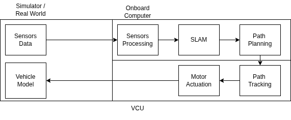

# MSimFSAE: Minimal FSAE Autonomous Driving Simulator in ROS2 

This Repository has the purpose to give a minimal functioning ROS2 Lyrical / Gazebo Jetty Simulator 
for the Formula Student Autonomous Driving tasks. \\
It's based upon the following principles: 
- Minimal 
- Modular 
- Highly Customizible 

The "High Level Overview" is  the following: 

It's in continuous development, and at the moment, not even the first release is available! 
Stay tuned. 